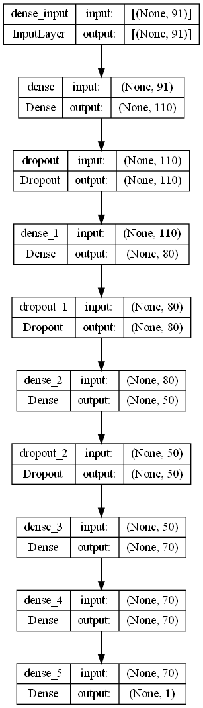
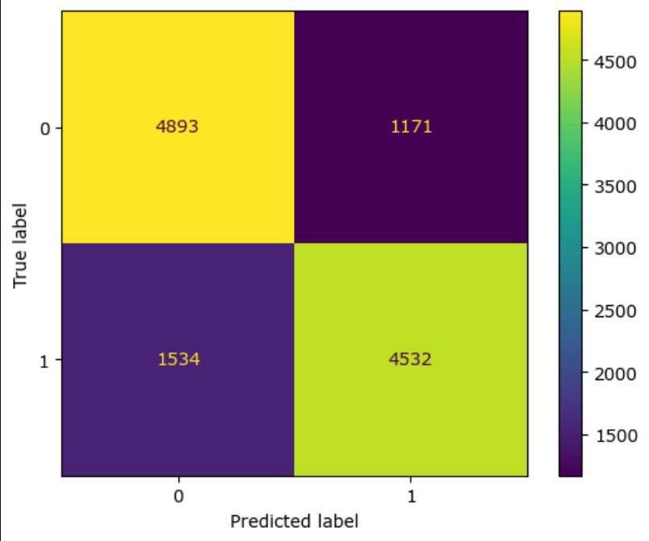
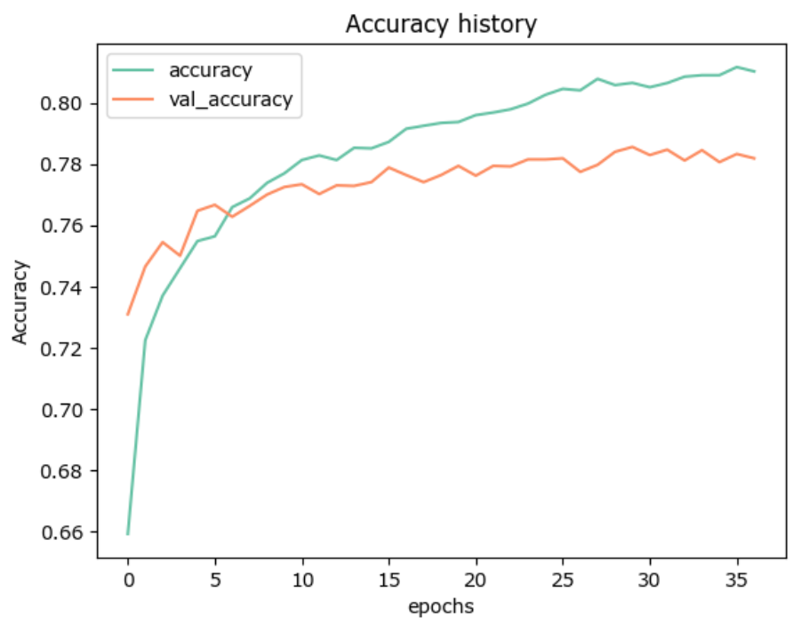

# Fake Review Detector

Overview

In 2023, e-commerce sales experienced a remarkable 12% growth compared to 2022. The number of digital buyers worldwide is estimated to be 2.6 billion. Products with reviews have a 270% higher conversion rate, emphasizing the importance of credible feedback. 89% of customers read reviews before purchasing a product, with 75% trusting online reviews as much as personal recommendations.
    
Did you know that around 40% of reviews online are fake? And out of those, 90% are just computer or AI generated, created to convince you about the product or service that you're browsing, instead of giving you information about other buyers.

We developed "RealView", using Natural Language Processing techniques to empower users with credible and trrustworthy reviews, ensuring better shopping decisions.

RealView is a revolutionary web browser extension and mobile app created to tackle this issue head-on. RealView allows users to input the product they're interested in and filters out computer or AI-generated reviews, showing only those written by actual people.

## Data Sources

To power Realview, we're using a data source from [OSF.IO](https://osf.io/tyue9), that consist of over 40.000 different reviews, both human made and computer generated. This balanced dataset allow us to develop a robust model for fake review detection.

## Methods
First, we worked on EDA to see if we can find differences between reviews being computer-generated or not:

We realized that except for a difference of the lenghts of both types of reviews, it's really hard to differentiate them.

After, we started to create the model to classify the reviews.

For this project, we focus on creating the best possible model to detect fake reviews. Our technical approach involves:
    
* Multiple Models: Five different hyperparameter tuned models were used to optimize and check the accuracy.
    
* Ensemble MEthods: After that, we combined them together in different ways to further improve our model's accuracy.

* Neural Network: We apply advanced neural network algorithm to further refine our results.

## Results

After many different iterations, this is the best performing model we found:

## Recommendations

* Use the feedback collected from users to continuously improve your product
* Ensure that your system is scalable to handle a growing number of users and a vast amount of data
* Collaborate with e-commerce platforms and retailers to integrate your RealView technology directly into their websites

## Next Steps

* Create a Feedback Mechanism,  that enables users to report suspicious reviews 
* Extend the reach of RealView to international markets and multiple languages
    